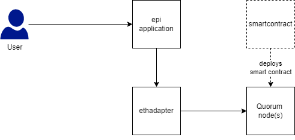

# pharmaledger-helmcharts

Helm Charts for Pharma Ledger

## Requirements

- [helm 3](https://helm.sh/docs/intro/install/)

## Installing the Helm Repository

Add the repo as follow

```bash
helm repo add ph-ethadapter https://pharmaledger-imi.github.io/helmchart-ethadapter
```

Then you can run `helm search repo ph-ethadapter` to see the chart(s). On installation use the `--version` flag to specify a chart version.

## Charts

You will find the Helm charts in subfolders of [charts](charts).

| Name | Description |
| ---- | ------ |
| [ethadapter](charts/ethadapter/README.md) | Pharma Ledger Ethereum Adapter Service |
| [epi](charts/epi/README.md) | Pharma Ledger epi (electronic product information) application |
| [goquorum-genesis](charts/goquorum-genesis-dev/README.md) | Quorum Genesis generator with Helm chart in Kubernetes - NOTE: DOES NOT WORK YET!|
| [goquorum-node](charts/goquorum-node-dev/README.md) | Quorum node for a POA network using IBFT for consensys - NOTE: DOES NOT WORK YET!|
| [standalone-quorum](charts/standalone-quorum/README.md) | **Sandbox only:** Standalone Quorum network |
| [smartcontract](charts/smartcontract/README.md) | **Sandbox only:** Deployment of the smart contract and creation of input parameters for ethadapter in form of a Kubernetes ConfigMap and Secret |

## Helm Unittesting

[helm-unittest](https://github.com/quintush/helm-unittest) is being used for testing the expected output of the helm chart.

Example: See [ethadapter/tests](./charts/ethadapter/tests)

## Sandbox environment

Abstract Overview



### Install Quorum network, Smart Contract, ethadapter and epi application

```bash
echo "Deploying sandbox quorum"
helm upgrade --install quorum ph-ethadapter/standalone-quorum \
    --namespace=quorum --create-namespace \
    --version=0.2.1 \
    --set config.storage.size="10Gi" \
    --set config.storage.type=pvc \
    --wait --wait-for-jobs \
    --timeout 10m

echo ""
echo "Deploying SmartContract"
helm upgrade --install smartcontract ph-ethadapter/smartcontract \
    --namespace=ethadapter --create-namespace \
    --version=0.2.0 \
    --wait --wait-for-jobs \
    --timeout 10m

echo ""
echo "Deploying EthAdapter"
echo "Note: It will use values from ConfigMap and Secret created by SmartContract deployment"
helm upgrade --install ethadapter ph-ethadapter/ethadapter \
    --namespace=ethadapter --create-namespace \
    --version=0.3.0 \
    --wait --wait-for-jobs \
    --timeout 10m

echo ""
echo "Deploying epi application"
helm upgrade --install epi ph-ethadapter/epi \
    --namespace=epi --create-namespace \
    --version=0.2.0 \
    --wait --wait-for-jobs \
    --timeout 10m \
    --set config.ethadapterUrl=http://ethadapter.ethadapter:3000

```

### Uninstall

```bash
helm delete --namespace=epi epi
helm delete --namespace=ethadapter ethadapter
helm delete --namespace=ethadapter smartcontract
helm delete --namespace=quorum quorum
kubectl delete namespace epi ethadapter quorum

```
