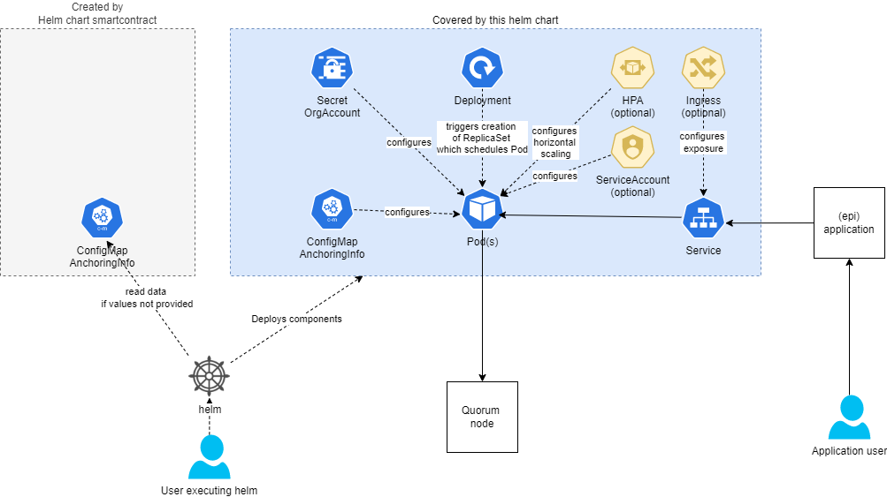

# ethadapter

  

A Helm chart for Pharma Ledger Ethereum Adapter Service

## Requirements

- [helm 3](https://helm.sh/docs/intro/install/)
- These values:

  | Configuration<br/>value | Description | Sandbox | Non-Sandbox<br/>connected blockchain |
  |-------------------------|:-----------:|:-------:|:------------------------------------:|
  | `config.rpcAddress`     | Address of<br/>Quorum node | **Not required** if helm chart<br/>*standalone-quorum* is used | **Required** |
  | `config.smartContractAddress` | Anchor address of<br/>Smart Contract | **Not required** if helm chart<br/>*smartcontract* is used<br/>(autoconfiguration) | **Required** |
  | `config.smartContractAbi` | Smart Contract<br>definition | **Not required**<br/>Default value fits<br/>for epi application >= v1.1 | **Not required**<br/>Default value fits<br/>for epi application >= v1.1 |
  | `secrets.orgAccountJson`<br/>**or**<br/>`secrets.orgAccountJsonBase64` | ETH account and<br/>private key | **Required** | **Required** |

  <!-- # pragma: allowlist nextline secret -->
  **Note about ETH account:** For Sandbox environment (helm chart *standalone-quorum*) use `{"address": "0xb5ced4530d6ccbb31b2b542fd9b4558b52296784", "privateKey": "0x6b93a268f68239d321981125ecf24488920c6b3d900043d56fef66adb776abd5"}`

## Changelog

- From 0.3.x to 0.4.x
  - New SmartContract Abi set as default value ready for epi application v1.1.x or higher.
  - Either value `secrets.orgAccountJson` or `secrets.orgAccountJsonBase64` is always required. The OrgAccount data is not be provided by helm chart *smartcontract* anymore.

- From 0.2.x to 0.3.x
  - Value `config.rpcAddress` has changed from `http://quorum-member1.quorum:8545` to `http://quorum-validator1.quorum:8545`.
  This reflects the change of chart [standalone-quorum](https://github.com/PharmaLedger-IMI/helmchart-ethadapter/tree/standalone-quorum-0.2.0/charts/standalone-quorum#changelog) from version 0.1.x to 0.2.x where member nodes are not enabled by default.

## Usage

- [Here](./README.md#values) is a full list of all configuration values.
- The [values.yaml file](./values.yaml) shows the raw view of all configuration values.

## How it works

This helm chart creates an own ConfigMap and Secret with required configuration values.

- The ConfigMap is being used to store a) address of Quorum Node, b) address of Smart Contract anchoring and c) Abi of the SmartContract.
- The Secret contains the ETH Account and its private key.

In case you do not explictly provide `config.smartContractAddress` this value will be read from pre-existing ConfigMap (provided by helm chart *smartcontract*) in context of the user executing helm.

1. The Kubernetes Deployment triggers creation of a ReplicaSet which schedules the pod(s).
2. A Service exposes the pod. **By default, this helm chart installs the Ethereum Adapter Service at an internal ClusterIP Service listening at port 3000.
This is to prevent exposing the service to the internet by accident!**



## Installing the Chart

**Note:** It is recommended to put non-sensitive configuration values in an configuration file and pass sensitive/secret values via commandline.

### Sandbox installation - Auto-configure Smart Contract address

Install the chart with the release name `ethadapter` in namespace `ethadapter` and read SmartContract address from pre-existing ConfigMap created by helm chart *smartcontract*.

```bash
helm upgrade --install ethadapter ph-ethadapter/ethadapter --version=0.4.0 \
  --install \
  --set secrets.orgAccountJson="\{\"address\": \"0xb5ced4530d6ccbb31b2b542fd9b4558b52296784\"\, \"privateKey\": \"0x6b93a268f68239d321981125ecf24488920c6b3d900043d56fef66adb776abd5\"\}"
  --wait \
  --timeout 10m

```

### Non-Sandbox installation - Provide required values

1. Create configuration file, e.g. *my-config.yaml*

    ```yaml
    config:
      rpcAddress: "rpcAddress_value"
      smartContractAddress: "smartContractAddress_value"
    ```

2. Install via helm to namespace `ethadapter` either by passing sensitive *Org Account JSON* value in JSON format as escaped string

    ```bash
    helm upgrade --install ethadapter ph-ethadapter/ethadapter --version=0.4.0 \
        --wait \
        --timeout 10m \
        --values my-config.yaml \
        --set-string secrets.orgAccountJson="\{ \"address\": \"0xabcdef1234567890\" \, \"privateKey\": \"0x1234567890abcdef\" \}"

    ```

3. or pass sensitive *Org Account JSON* value in JSON format as base64 encoded string

    ```bash
    helm upgrade --install ethadapter ph-ethadapter/ethadapter --version=0.4.0 \
        --wait \
        --timeout 10m \
        --values my-config.yaml \
        --set-string secrets.orgAccountJsonBase64="eyAia2V5IjogInZhbHVlIiB9"

    ```

### Expose Service via Load Balancer

In order to expose the service **directly** by an **own dedicated** Load Balancer, just **add** `service.type` with value `LoadBalancer` to your config file (in order to override the default value which is `ClusterIP`).

**Note:** At AWS using `service.type` = `LoadBalancer` is not recommended any more, as it creates a Classic Load Balancer.
Use [AWS Load Balancer Controller](https://kubernetes-sigs.github.io/aws-load-balancer-controller/v2.3/) with an ingress instead.
A full sample is provided later in the docs.
Using an Application Load Balancer (managed by AWS LB Controller) increases security (e.g. by using a Web Application Firewall for your http based traffic)
and provides more features like hostname, pathname routing or built-in authentication mechanism via OIDC or AWS Cognito.

Configuration file *my-config.yaml*

```yaml
service:
  type: LoadBalancer

config:
  rpcAddress: "rpcAddress_value"
  smartContractAddress: "smartContractAddress_value"
```

There are more configuration options available like customizing the port and configuring the Load Balancer via annotations (e.g. for configuring SSL Listener).

**Also note:** Annotations are very specific to your environment/cloud provider, see [Kubernetes Service Reference](https://kubernetes.io/docs/concepts/services-networking/service/#ssl-support-on-aws) for more information. For Azure, take a look [here](https://kubernetes-sigs.github.io/cloud-provider-azure/topics/loadbalancer/#loadbalancer-annotations).

Sample for AWS (SSL and listening on port 4567 instead 3000 which is the default):

```yaml
service:
  type: LoadBalancer
  port: 4567
  annotations:
    service.beta.kubernetes.io/aws-load-balancer-ssl-cert: arn:aws:acm:us-east-1:123456789012:certificate/12345678-1234-1234-1234-123456789012
    service.beta.kubernetes.io/aws-load-balancer-backend-protocol: http
    service.beta.kubernetes.io/aws-load-balancer-ssl-ports: "4567"
    # https://docs.aws.amazon.com/de_de/elasticloadbalancing/latest/classic/elb-security-policy-table.html
    service.beta.kubernetes.io/aws-load-balancer-ssl-negotiation-policy: "ELBSecurityPolicy-TLS-1-2-2017-01"

# further config
```

### AWS Load Balancer Controler: Expose Service via Ingress

Note: You need the [AWS Load Balancer Controller](https://kubernetes-sigs.github.io/aws-load-balancer-controller/) installed and configured properly.

1. Enable ingress
2. Add *host*, *path* *`/*`* and *pathType* `ImplementationSpecific`
3. Add annotations for AWS LB Controller
4. A SSL certificate at AWS Certificate Manager (either for the hostname, here `ethadapter.mydomain.com` or wildcard `*.mydomain.com`)

Configuration file *my-config.yaml*

```yaml
ingress:
  enabled: true
  # Let AWS LB Controller handle the ingress (default className is alb)
  # Note: Use className instead of annotation 'kubernetes.io/ingress.class' which is deprecated since 1.18
  # For Kubernetes >= 1.18 it is required to have an existing IngressClass object.
  # See: https://kubernetes.io/docs/concepts/services-networking/ingress/#deprecated-annotation
  className: alb
  hosts:
    - host: ethadapter.mydomain.com
      # Path must be /* for ALB to match all paths
      paths:
        - path: /*
          pathType: ImplementationSpecific
  # For full list of annotations for AWS LB Controller, see https://kubernetes-sigs.github.io/aws-load-balancer-controller/v2.3/guide/ingress/annotations/
  annotations:
    # The ARN of the existing SSL Certificate at AWS Certificate Manager
    alb.ingress.kubernetes.io/certificate-arn: arn:aws:acm:REGION:ACCOUNT_ID:certificate/CERTIFICATE_ID
    # The name of the ALB group, can be used to configure a single ALB by multiple ingress objects
    alb.ingress.kubernetes.io/group.name: default
    # Specifies the HTTP path when performing health check on targets.
    alb.ingress.kubernetes.io/healthcheck-path: /check
    # Specifies the port used when performing health check on targets.
    alb.ingress.kubernetes.io/healthcheck-port: traffic-port
    # Specifies the HTTP status code that should be expected when doing health checks against the specified health check path.
    alb.ingress.kubernetes.io/success-codes: "200"
    # Listen on HTTPS protocol at port 3000 at the ALB
    alb.ingress.kubernetes.io/listen-ports: '[{"HTTPS":3000}]'
    # Allow access from a specific IP address only, e.g. from the NAT Gateway of your EPI Cluster
    alb.ingress.kubernetes.io/inbound-cidrs: 8.8.8.8/32
    # Use internet facing
    alb.ingress.kubernetes.io/scheme: internet-facing
    # Use most current (as of Dec 2021) encryption ciphers
    alb.ingress.kubernetes.io/ssl-policy: ELBSecurityPolicy-TLS-1-2-Ext-2018-06
    # Use target type IP which is the case if the service type is ClusterIP
    alb.ingress.kubernetes.io/target-type: ip

config:
  rpcAddress: "rpcAddress_value"
  smartContractAddress: "smartContractAddress_value"
```

## Uninstalling the Chart

To uninstall/delete the `ethadapter` deployment:

```bash
helm delete ethadapter \
  --namespace=ethadapter

```

### Potential issues

1. `Error: admission webhook "vingress.elbv2.k8s.aws" denied the request: invalid ingress class: IngressClass.networking.k8s.io "alb" not found`

    **Description:** This error only applies to Kubernetes >= 1.18 and indicates that no matching *IngressClass* object was found.

    **Solution:** Either declare an appropriate IngressClass or omit *className* and add annotation `kubernetes.io/ingress.class`

    Further information:

     - [Kubernetes IngressClass](https://kubernetes.io/docs/concepts/services-networking/ingress/#ingress-class)
     - [AWS Load Balancer controller documentation](https://kubernetes-sigs.github.io/aws-load-balancer-controller/v2.3/guide/ingress/ingress_class/)

## Helm Unittesting

[helm-unittest](https://github.com/quintush/helm-unittest) is being used for testing the output of the helm chart.
Tests can be found in [tests](./tests)

## Manual Tests

See [Helm Debugging Templates](https://helm.sh/docs/chart_template_guide/debugging/)

```bash
mkdir -p ./testresults
rm -rf ./testresults/*
# https://github.com/helm/helm/issues/5618
echo ""
echo "Default values and secret passed as String"
helm template test-ethadapter ph-ethadapter/ethadapter --version=0.4.0 --values ./tests/data/default.yaml --set-string secrets.orgAccountJson="\{ \"key\": \"value\" \}" > ./tests/results/result_default2.yaml

echo ""
echo "Default values and secret passed as base64 encoded String"
helm template test-ethadapter ph-ethadapter/ethadapter --version=0.4.0 --values ./tests/data/default.yaml --set-string secrets.orgAccountJsonBase64="eyAia2V5IjogInZhbHVlIiB9" > ./tests/results/result_default_base64.yaml

echo ""
echo "LoadBalancer"
helm template test-ethadapter ph-ethadapter/ethadapter --version=0.4.0 --values ./tests/data/loadbalancer.yaml --set-string secrets.orgAccountJsonBase64="eyAia2V5IjogInZhbHVlIiB9" > ./tests/results/result_loadbalancer.yaml

echo ""
echo "LoadBalancer and annotations"
helm template test-ethadapter ph-ethadapter/ethadapter --version=0.4.0 --values ./tests/data/loadbalancer_annotations.yaml --set-string secrets.orgAccountJsonBase64="eyAia2V5IjogInZhbHVlIiB9" > ./tests/results/result_loadbalancer_annotations.yaml

echo ""
echo "Ingress via AWS LB Controller"
helm template test-ethadapter ph-ethadapter/ethadapter --version=0.4.0 --values ./tests/data/aws_lb_controller_ingress.yaml --set-string secrets.orgAccountJsonBase64="eyAia2V5IjogInZhbHVlIiB9" > ./tests/results/result_aws_lb_controller_ingress.yaml
```

## Maintainers

| Name | Email | Url |
| ---- | ------ | --- |
| tgip-work |  | https://github.com/tgip-work |

## Values

| Key | Type | Default | Description |
|-----|------|---------|-------------|
| affinity | object | `{}` | Affinity for scheduling a pod. See [https://kubernetes.io/docs/concepts/scheduling-eviction/assign-pod-node/](https://kubernetes.io/docs/concepts/scheduling-eviction/assign-pod-node/) |
| autoscaling.enabled | bool | `false` | Whether to enable horizontal pod autoscaling or not. See [https://kubernetes.io/de/docs/tasks/run-application/horizontal-pod-autoscale/](https://kubernetes.io/de/docs/tasks/run-application/horizontal-pod-autoscale/) |
| autoscaling.maxReplicas | int | `100` | The maximum number of replicas in case autoscaling is enabled. |
| autoscaling.minReplicas | int | `1` | The minimum number of replicas in case autoscaling is enabled. |
| autoscaling.targetCPUUtilizationPercentage | int | `80` | The CPU utilization in percentage as a target for autoscaling. |
| config.rpcAddress | string | `"http://quorum-validator1.quorum:8545"` | URL of the Quorum node |
| config.smartContractAbi | string | `"[{\"inputs\":[],\"stateMutability\":\"nonpayable\",\"type\":\"constructor\"},{\"anonymous\":false,\"inputs\":[{\"indexed\":false,\"internalType\":\"bool\",\"name\":\"str\",\"type\":\"bool\"}],\"name\":\"BoolResult\",\"type\":\"event\"},{\"anonymous\":false,\"inputs\":[{\"indexed\":false,\"internalType\":\"bytes1\",\"name\":\"str\",\"type\":\"bytes1\"}],\"name\":\"Bytes1Result\",\"type\":\"event\"},{\"anonymous\":false,\"inputs\":[{\"indexed\":false,\"internalType\":\"bytes32\",\"name\":\"str\",\"type\":\"bytes32\"}],\"name\":\"Bytes32Result\",\"type\":\"event\"},{\"anonymous\":false,\"inputs\":[{\"indexed\":true,\"internalType\":\"uint256\",\"name\":\"statusCode\",\"type\":\"uint256\"}],\"name\":\"InvokeStatus\",\"type\":\"event\"},{\"anonymous\":false,\"inputs\":[{\"indexed\":false,\"internalType\":\"bytes\",\"name\":\"str\",\"type\":\"bytes\"}],\"name\":\"Result\",\"type\":\"event\"},{\"anonymous\":false,\"inputs\":[{\"indexed\":false,\"internalType\":\"string[2]\",\"name\":\"str\",\"type\":\"string[2]\"}],\"name\":\"StringArray2Result\",\"type\":\"event\"},{\"anonymous\":false,\"inputs\":[{\"indexed\":false,\"internalType\":\"string[]\",\"name\":\"str\",\"type\":\"string[]\"}],\"name\":\"StringArrayResult\",\"type\":\"event\"},{\"anonymous\":false,\"inputs\":[{\"indexed\":false,\"internalType\":\"string\",\"name\":\"str\",\"type\":\"string\"}],\"name\":\"StringResult\",\"type\":\"event\"},{\"anonymous\":false,\"inputs\":[{\"indexed\":false,\"internalType\":\"uint256\",\"name\":\"str\",\"type\":\"uint256\"}],\"name\":\"UIntResult\",\"type\":\"event\"},{\"inputs\":[{\"internalType\":\"string\",\"name\":\"anchorId\",\"type\":\"string\"},{\"internalType\":\"string\",\"name\":\"newAnchorValue\",\"type\":\"string\"},{\"internalType\":\"uint8\",\"name\":\"v\",\"type\":\"uint8\"}],\"name\":\"createAnchor\",\"outputs\":[],\"stateMutability\":\"nonpayable\",\"type\":\"function\"},{\"inputs\":[{\"internalType\":\"string\",\"name\":\"anchorId\",\"type\":\"string\"},{\"internalType\":\"string\",\"name\":\"newAnchorValue\",\"type\":\"string\"},{\"internalType\":\"uint8\",\"name\":\"v\",\"type\":\"uint8\"}],\"name\":\"appendAnchor\",\"outputs\":[],\"stateMutability\":\"nonpayable\",\"type\":\"function\"},{\"inputs\":[{\"internalType\":\"string\",\"name\":\"anchorId\",\"type\":\"string\"}],\"name\":\"getAllVersions\",\"outputs\":[{\"internalType\":\"string[]\",\"name\":\"\",\"type\":\"string[]\"}],\"stateMutability\":\"view\",\"type\":\"function\",\"constant\":true},{\"inputs\":[{\"internalType\":\"string\",\"name\":\"anchorId\",\"type\":\"string\"}],\"name\":\"getLastVersion\",\"outputs\":[{\"internalType\":\"string\",\"name\":\"\",\"type\":\"string\"}],\"stateMutability\":\"view\",\"type\":\"function\",\"constant\":true},{\"inputs\":[{\"internalType\":\"string[]\",\"name\":\"anchors\",\"type\":\"string[]\"}],\"name\":\"createOrUpdateMultipleAnchors\",\"outputs\":[],\"stateMutability\":\"nonpayable\",\"type\":\"function\"},{\"inputs\":[{\"internalType\":\"uint256\",\"name\":\"from\",\"type\":\"uint256\"},{\"internalType\":\"uint256\",\"name\":\"limit\",\"type\":\"uint256\"},{\"internalType\":\"uint256\",\"name\":\"maxSize\",\"type\":\"uint256\"}],\"name\":\"dumpAnchors\",\"outputs\":[{\"components\":[{\"internalType\":\"string\",\"name\":\"anchorId\",\"type\":\"string\"},{\"internalType\":\"string[]\",\"name\":\"anchorValues\",\"type\":\"string[]\"}],\"internalType\":\"struct Anchoring.Anchor[]\",\"name\":\"\",\"type\":\"tuple[]\"}],\"stateMutability\":\"nonpayable\",\"type\":\"function\"},{\"inputs\":[],\"name\":\"totalNumberOfAnchors\",\"outputs\":[{\"internalType\":\"uint256\",\"name\":\"\",\"type\":\"uint256\"}],\"stateMutability\":\"nonpayable\",\"type\":\"function\"},{\"inputs\":[{\"internalType\":\"bytes32\",\"name\":\"hash\",\"type\":\"bytes32\"},{\"internalType\":\"bytes\",\"name\":\"signature\",\"type\":\"bytes\"},{\"internalType\":\"uint8\",\"name\":\"v\",\"type\":\"uint8\"}],\"name\":\"recover\",\"outputs\":[{\"internalType\":\"address\",\"name\":\"\",\"type\":\"address\"}],\"stateMutability\":\"nonpayable\",\"type\":\"function\"}]"` | Abi (interface) of the Smart Contract. Must match the Abi of the deployed Smartcontract. Current default value compatible to epi application v1.1.x or higher Taken from https://github.com/PharmaLedger-IMI/eth-adapter/blob/2cc324b54c55e7b0019d46f2202740dcfa54444a/EthAdapter/k8s/ethadapter-configmap.yaml#L8 |
| config.smartContractAddress | string | `""` | Address of the Smart Contract. If not set/empty, tries to get value from ConfigMap '.config.smartContractConfigMapName' with key '.config.smartContractConfigMapAddressKey' |
| config.smartContractConfigMapAddressKey | string | `"address"` | The key of the SmartContract Address in the existing ConfigMap in case 'smartContractAddress' is not explictly defined. |
| config.smartContractConfigMapName | string | `"smartcontract-anchoring-info"` | The name of the existing ConfigMap to look for in case value 'smartContractAddress' is not defined. |
| fullnameOverride | string | `""` | fullnameOverride completely replaces the generated name. From [https://stackoverflow.com/questions/63838705/what-is-the-difference-between-fullnameoverride-and-nameoverride-in-helm](https://stackoverflow.com/questions/63838705/what-is-the-difference-between-fullnameoverride-and-nameoverride-in-helm) |
| image.pullPolicy | string | `"IfNotPresent"` | Image Pull Policy |
| image.repository | string | `"pharmaledger/apiadapter"` | The repository of the container image |
| image.tag | string | `""` | Overrides the image tag whose default is the chart appVersion. |
| imagePullSecrets | list | `[]` | Secret(s) for pulling an container image from a private registry. See [https://kubernetes.io/docs/tasks/configure-pod-container/pull-image-private-registry/](https://kubernetes.io/docs/tasks/configure-pod-container/pull-image-private-registry/) |
| ingress.annotations | object | `{}` | Ingress annotations. For AWS LB Controller, see [https://kubernetes-sigs.github.io/aws-load-balancer-controller/v2.3/guide/ingress/annotations/](https://kubernetes-sigs.github.io/aws-load-balancer-controller/v2.3/guide/ingress/annotations/) For Azure Application Gateway Ingress Controller, see [https://azure.github.io/application-gateway-kubernetes-ingress/annotations/](https://azure.github.io/application-gateway-kubernetes-ingress/annotations/) For NGINX Ingress Controller, see [https://kubernetes.github.io/ingress-nginx/user-guide/nginx-configuration/annotations/](https://kubernetes.github.io/ingress-nginx/user-guide/nginx-configuration/annotations/) For Traefik Ingress Controller, see [https://doc.traefik.io/traefik/routing/providers/kubernetes-ingress/#annotations](https://doc.traefik.io/traefik/routing/providers/kubernetes-ingress/#annotations) |
| ingress.className | string | `""` | The className specifies the IngressClass object which is responsible for that class. Note for Kubernetes >= 1.18 it is required to have an existing IngressClass object. If IngressClass object does not exists, omit className and add the deprecated annotation 'kubernetes.io/ingress.class' instead. For Kubernetes < 1.18 either use className or annotation 'kubernetes.io/ingress.class'. See https://kubernetes.io/docs/concepts/services-networking/ingress/#ingress-class |
| ingress.enabled | bool | `false` | Whether to create ingress or not. Note: For ingress an Ingress Controller (e.g. AWS LB Controller, NGINX Ingress Controller, Traefik, ...) is required and service.type should be ClusterIP or NodePort depending on your configuration |
| ingress.hosts[0].host | string | `"ethadapter.some-pharma-company.com"` | The FQDN/hostname |
| ingress.hosts[0].paths[0].path | string | `"/"` | The Ingress Path. See [https://kubernetes.io/docs/concepts/services-networking/ingress/#examples](https://kubernetes.io/docs/concepts/services-networking/ingress/#examples) Note: For Ingress Controllers like AWS LB Controller see their specific documentation. |
| ingress.hosts[0].paths[0].pathType | string | `"ImplementationSpecific"` | The type of path. This value is required since Kubernetes 1.18. For Ingress Controllers like AWS LB Controller or Traefik it is usually required to set its value to ImplementationSpecific See [https://kubernetes.io/docs/concepts/services-networking/ingress/#path-types](https://kubernetes.io/docs/concepts/services-networking/ingress/#path-types) and [https://kubernetes.io/blog/2020/04/02/improvements-to-the-ingress-api-in-kubernetes-1.18/](https://kubernetes.io/blog/2020/04/02/improvements-to-the-ingress-api-in-kubernetes-1.18/) |
| ingress.tls | list | `[]` |  |
| nameOverride | string | `""` | nameOverride replaces the name of the chart in the Chart.yaml file, when this is used to construct Kubernetes object names. From [https://stackoverflow.com/questions/63838705/what-is-the-difference-between-fullnameoverride-and-nameoverride-in-helm](https://stackoverflow.com/questions/63838705/what-is-the-difference-between-fullnameoverride-and-nameoverride-in-helm) |
| nodeSelector | object | `{}` | Node Selectors in order to assign pods to certain nodes. See [https://kubernetes.io/docs/concepts/scheduling-eviction/assign-pod-node/](https://kubernetes.io/docs/concepts/scheduling-eviction/assign-pod-node/) |
| podAnnotations | object | `{}` | Annotations added to the pod |
| podSecurityContext | object | `{}` | Security Context for the pod. See [https://kubernetes.io/docs/tasks/configure-pod-container/security-context/#set-the-security-context-for-a-pod](https://kubernetes.io/docs/tasks/configure-pod-container/security-context/#set-the-security-context-for-a-pod) |
| replicaCount | int | `1` | The number of replicas if autoscaling is false |
| resources | object | `{}` | Resource constraints for a pod |
| secrets.orgAccountJson | string | `""` | Org Account in JSON format. This value must be set or orgAccountJsonBase64. |
| secrets.orgAccountJsonBase64 | string | `""` | Org Account in JSON format base64 encoded. This value must be set or orgAccountJson |
| securityContext | object | `{}` | Security Context for the container. See [https://kubernetes.io/docs/tasks/configure-pod-container/security-context/#set-the-security-context-for-a-container](https://kubernetes.io/docs/tasks/configure-pod-container/security-context/#set-the-security-context-for-a-container) |
| service.annotations | object | `{}` | Annotations for the service. See AWS, see [https://kubernetes.io/docs/concepts/services-networking/service/#ssl-support-on-aws](https://kubernetes.io/docs/concepts/services-networking/service/#ssl-support-on-aws) For Azure, see [https://kubernetes-sigs.github.io/cloud-provider-azure/topics/loadbalancer/#loadbalancer-annotations](https://kubernetes-sigs.github.io/cloud-provider-azure/topics/loadbalancer/#loadbalancer-annotations) |
| service.port | int | `3000` | Port where the service will be exposed |
| service.type | string | `"ClusterIP"` | Either ClusterIP, NodePort or LoadBalancer. See [https://kubernetes.io/docs/concepts/services-networking/service/](https://kubernetes.io/docs/concepts/services-networking/service/) |
| serviceAccount.annotations | object | `{}` | Annotations to add to the service account |
| serviceAccount.create | bool | `false` | Specifies whether a service account should be created |
| serviceAccount.name | string | `""` | The name of the service account to use. If not set and create is true, a name is generated using the fullname template |
| tolerations | list | `[]` | Tolerations for scheduling a pod. See [https://kubernetes.io/docs/concepts/scheduling-eviction/taint-and-toleration/](https://kubernetes.io/docs/concepts/scheduling-eviction/taint-and-toleration/) |

----------------------------------------------
Autogenerated from chart metadata using [helm-docs v1.5.0](https://github.com/norwoodj/helm-docs/releases/v1.5.0)
