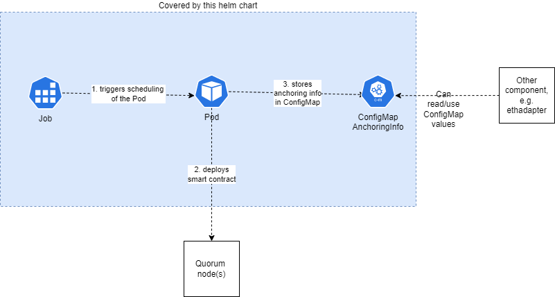

# smartcontract

  

A Helm chart for deploying the Smartcontract on a goquorum node for a given ETH account.
The anchoring info (address and Abi) of the Smartcontract will be stored in a Kubernetes ConfigMap to make them usable by other components running on Kubernetes.

## Requirements

- [helm 3](https://helm.sh/docs/intro/install/)
- These values:

  | Configuration<br/>value | Description | Sandbox | Non-Sandbox<br/>connected blockchain |
  |-------------------------|:-----------:|:-------:|:------------------------------------:|
  | `config.quorumNodeAddress`<br/>and `config.quorumNodePort` | Address of<br/>Quorum node | **Not required**<br/>Defaults to first node of<br/>helm chart *standalone-quorum* | **Required** |
  | `config.account` | ETH account address<br/>of preexisting and unlocked account. | **Not required**<br/>Defaults to an account provided<br/>by helm chart *standalone-quorum* | **Required** |

## Changelog

- From 0.2.x to 0.3.x
  - Uses `pharmaledger/anchor_smart:latest` image for SmartContract anchoring (`image.repository` and `image.tag`) which is compatible to epi application v1.1.x or higher. Not compatible with epi v1.0.x !
  - An preexisting ETH Account that you own needs must be provided. A new ETH account will *NOT* be created anymore.
  - Therefore no secret with OrgAccount data will be created anymore.
  - `config.quorumNodeUrl` has been replaced by `config.quorumNodeAddress` and `config.quorumNodePort`.
  - `config.account` defaults to an ETH account created by helm chart *standalone-quorum*.
  - `config.anchoringSC` has been removed. The SmartContract definition is now part of the container image.

- From 0.1.x to 0.2.x
  - Value `config.quorumNodeUrl` has changed from `http://quorum-member1.quorum:8545` to `http://quorum-validator1.quorum:8545`.
  This reflects the change of chart [standalone-quorum](https://github.com/PharmaLedger-IMI/helmchart-ethadapter/tree/standalone-quorum-0.2.0/charts/standalone-quorum#changelog) from version 0.1.x to 0.2.x where member nodes are not enabled by default.

## Usage

- [Here](./README.md#values) is a full list of all configuration values.
- The [values.yaml file](./values.yaml) shows the raw view of all configuration values.

## How it works

1. A Kubernetes Job will be deployed which triggers scheduling of a Pod
2. The Pod compiles the SmartContract and anchors it with the configure ETH account on the Quorum Blockchain.
3. Then the address and Abi of the SmartContract will be stored in a Kubernetes ConfigMap.



Note: Persisting these values in Kubernetes ConfigMap enables passing values and easier configuration of *ethadapter* on a Sandbox environment.

## Installing the Chart

### Sandbox installation

**IMPORTANT** On a sandbox environment, install into the same namespace as *ethadapter* (usually namespace `ethadapter`). Otherwise *ethadapter* cannot auto-configure itself by reading values from Secret and ConfigMap.

```bash
helm upgrade --install smartcontract ph-ethadapter/smartcontract \
  --version=0.3.0 \
  --namespace=ethadapter --create-namespace \
  --wait --wait-for-jobs \
  --timeout 10m

```

### Non-Sandbox installation

**Note:** An installation on non-Sandbox is usually not required as the SmartContract is already deployed on connected Blockchain network.

```bash
helm upgrade --install smartcontract ph-ethadapter/smartcontract \
  --version=0.3.0 \
  --namespace=ethadapter --create-namespace \
  --wait --wait-for-jobs \
  --timeout 10m \
  --set config.quorumNodeAddress="mynode.company.com" \
  --set config.quorumNodePort=5432 \
  --set config.account="0x1234567890abcdef"
```

## Uninstalling the Chart

To uninstall/delete the `smartcontract` deployment:

```bash
helm delete smartcontract \
  --namespace=ethadapter

```

## Maintainers

| Name | Email | Url |
| ---- | ------ | --- |
| tgip-work |  | https://github.com/tgip-work |

## Values

| Key | Type | Default | Description |
|-----|------|---------|-------------|
| affinity | object | `{}` |  |
| config.account | string | `"0xb5ced4530d6ccbb31b2b542fd9b4558b52296784"` | Existing account on Blockchain network Defaults to the predefined account from node 'quorum-validator1' deployed by helm chart 'standalone-quorum' |
| config.configMapAnchoringInfoName | string | `"smartcontract-anchoring-info"` | Name of the ConfigMap with the anchoring info. If empty uses a generic name |
| config.quorumNodeAddress | string | `"quorum-validator1.quorum"` | DNS Name or IP Address of Quorum node. Defaults to first Quorum node provided by helm chart 'standalone-quorum' on a Sandbox environment. |
| config.quorumNodePort | string | `"8545"` | Port of Quorum Node endpoint |
| fullnameOverride | string | `""` |  |
| image.pullPolicy | string | `"IfNotPresent"` | Image Pull Policy of the node container |
| image.repository | string | `"pharmaledger/anchor_smart"` | The repository of the container image which deploys the Smart Contract |
| image.tag | string | `"latest"` | The tag of the container image which deploys the Smart Contract |
| imagePullSecrets | list | `[]` |  |
| kubectlImage.pullPolicy | string | `"IfNotPresent"` | Image Pull Policy |
| kubectlImage.repository | string | `"bitnami/kubectl"` | The repository of the container image which creates configmap and secret |
| kubectlImage.tag | string | `"1.21.8"` | The Tag of the image containing kubectl. Minor Version should match to your Kubernetes Cluster Version. |
| nameOverride | string | `""` |  |
| nodeSelector | object | `{}` |  |
| serviceAccount.annotations | object | `{}` |  |
| serviceAccount.create | bool | `true` |  |
| serviceAccount.name | string | `""` |  |
| tolerations | list | `[]` |  |

----------------------------------------------
Autogenerated from chart metadata using [helm-docs v1.5.0](https://github.com/norwoodj/helm-docs/releases/v1.5.0)
